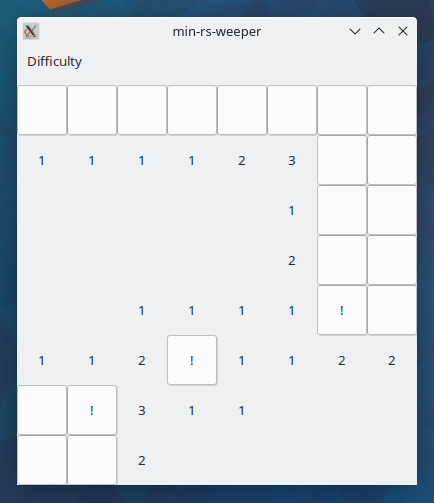

# Minesweeper! In Rust! With a GTK GUI!

Just a cute little project to play around with. It's a fully featured
Minesweeper clone.

## Controls:

- Left click to Uncover a tile
- Right click a covered tile to place a flag
- Right click an uncovered number tile to uncover unflagged neighbors
